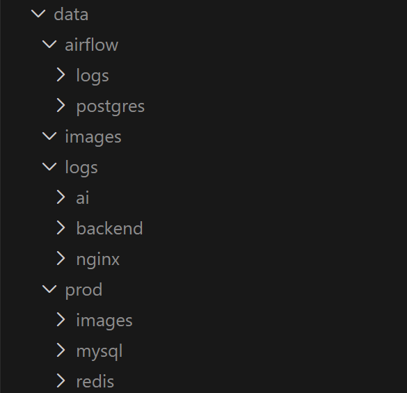

# 포팅 매뉴얼

본 문서는 이미지에 제시된 “포팅 매뉴얼 상세” 항목을 기준으로 작성되었습니다.

---

## 1. Gitlab 소스 클론 이후 빌드 및 배포 문서

### 1) 사용한 JVM, 웹서버, WAS 제품 종류/설정값/버전
- JVM: Java 17
- Backend(WAS): Spring Boot 3.2.2
- 빌드 도구: Maven Wrapper (mvnw)
- 웹서버: Nginx (Reverse Proxy, HTTPS)
- DB: MySQL 8.0
- Cache/Message: Redis 7
- 데이터 파이프라인: Apache Airflow 2.9.3 (Python 3.10), MetaDB Postgres 15
- AI 서버: FastAPI + Uvicorn
- Frontend: React 19 + Vite 7

### 2) 빌드 시 사용되는 환경 변수 상세
환경 변수는 `.env` 및 `.env.example`에 정의됩니다.

- MySQL
  - `MYSQL_DATABASE`, `MYSQL_ROOT_PASSWORD`, `MYSQL_USER`, `MYSQL_PASSWORD`
- Backend DB
  - `DB_HOST`, `DB_PORT`, `DB_NAME`, `DB_USERNAME`, `DB_PASSWORD`
- JWT
  - `JWT_SECRET`, `JWT_EXPIRATION`, `JWT_REFRESH_EXPIRATION`
- CORS
  - `CORS_ALLOWED_ORIGINS`
- SMTP
  - `MAIL_USERNAME`, `MAIL_PASSWORD`
- Docker Registry
  - `REGISTRY_IMAGE_BACKEND`, `REGISTRY_IMAGE_NGINX`, `REGISTRY_IMAGE_AI`
- WebRTC
  - `LIVEKIT_URL`, `LIVEKIT_API_KEY`, `LIVEKIT_API_SECRET`
  - (레거시 가능성) `OPENVIDU_URL`, `OPENVIDU_SECRET`
- GMS(OpenAI compatible)
  - `GMS_API_KEY`, `GMS_BASE_URL`
- Airflow
  - `AIRFLOW_DB_USER`, `AIRFLOW_DB_PASSWORD`, `AIRFLOW_DB_NAME`
  - `AIRFLOW__FERNET_KEY`, `AIRFLOW_WEBSERVER_SECRET_KEY`
  - `AIRFLOW_ADMIN_USER`, `AIRFLOW_ADMIN_PASSWORD`, `AIRFLOW_ADMIN_FIRSTNAME`, `AIRFLOW_ADMIN_LASTNAME`, `AIRFLOW_ADMIN_EMAIL`

### 3) 배포 시 특이사항
- 배포 Compose 파일: `docker-compose.prod.yml`
- Flyway 마이그레이션은 `migrate` 컨테이너에서 1회 실행
- 백엔드에서 Flyway는 비활성 (`SPRING_FLYWAY_ENABLED=false`)
- Nginx SSL 인증서 경로는 `/etc/letsencrypt` 마운트 필요
- 이미지 업로드 경로는 `/data/images`로 Nginx와 Backend 공유
- AI 서버는 프로파일 `ai`로 선택적 기동
- Dev MySQL 포트: 3307, Prod: 3306
- CI/CD
  - develop: `infra/jenkins/Jenkinsfile`
  - master: `infra/jenkins/prod/Jenkinsfile`

### 4) DB 접속 정보 등 프로젝트 주요 계정/프로퍼티 정의 파일 목록
- `.env`, `.env.example`
- `docker-compose.dev.yml`, `docker-compose.prod.yml`
- `app/backend/src/main/resources/application.properties`
- `app/backend/src/main/resources/application-docker.properties`
- DB 마이그레이션: `app/backend/src/main/resources/db/migration/*.sql`

---

## 2. 프로젝트에서 사용하는 외부 서비스 정보
- Gmail SMTP: `MAIL_USERNAME`, `MAIL_PASSWORD`
- LiveKit: `LIVEKIT_URL`, `LIVEKIT_API_KEY`, `LIVEKIT_API_SECRET`
- OpenVidu: `.env`에 존재 (레거시 가능성)
- GMS(OpenAI compatible LLM): `GMS_API_KEY`, `GMS_BASE_URL`
- Docker Hub Registry: `REGISTRY_IMAGE_*`
- Mattermost Webhook: Jenkins 알림용 (Jenkinsfile 내 credential)
- Let’s Encrypt: Nginx HTTPS 인증서

---

## 3. DB 덤프 파일 최신본
- 레포 내 DB 덤프 파일은 현재 존재하지 않음
- 참고 가능 파일
  - 더미 데이터: `scripts/dummy-data-dashboard-test.sql`
  - 스키마 마이그레이션: `app/backend/src/main/resources/db/migration/*.sql`

---

## 4. 시연 시나리오
### 0. 셋팅
- `S14P11B105/data`
  
  - 이미지와 같이 폴더 생성
  - docker compose -f docker-compose.dev.yml up --build -d 실행

- `S14P11B105/datapipeline/logs`폴더 추가

### 1) 더미 데이터 준비
- AI 재배치 용 더미데이터
  - `scripts/dummy-data-dashboard-test.sql` 실행
  - `scripts/simulate_worker_moves.py` 실행 -> 현장 관제맵에서 존 클릭후 작업자 지번 이동 확인 가능
  - 작업자 id : 01012341234
  - 작업자 비밀번호 : qwer123
  - 왼쪽 목록에 manage 선택
  - AI 재배치 진행
  - 현장 관제맵 -> zone 클릭 -> 작업자 지번 이동 확인
  - 

- 작업자 & 관리자 기능 확인용 더미데이터
  - `scripts/B105_lookie_data.sql`실행
  - 관리자 id : 010-1111-1111
  - 관리자 password : test1234
  - 작업자 id : 010-2222-2222
  - 작업자 password : test1234
  - 작업자는 테스트용 바코드를 사용하여 작업을 진행 -> exec/barcode
  - 출석 -> 작업시작하기 -> 토트스캔 -> 지번스캔 -> 상품 스캔
  - 상품 스캔 중 파손 / 재고없음 등록 -> 관리자 로그인 후 확인
  - 이슈 목록에서 이슈를 클릭 -> webRTC 연결
    - 작업자도 파손/재고없음에 대한 결과를 보고 webRTC 연결 가능

### 2) 관리자 로그인
- `POST /api/auth/login`

### 3) 대시보드 조회
- `GET /api/control/summary`
- `GET /api/control/zones`

### 4) AI 재배치 추천
- `POST /api/control/rebalance/recommend`

### 5) 재배치 적용
- `POST /api/control/rebalance/apply`

### 6) 이슈 확인 및 판정
- `GET /api/issues`
- `GET /api/issues/{id}`
- `POST /api/issues/{id}/admin/confirm`

---

